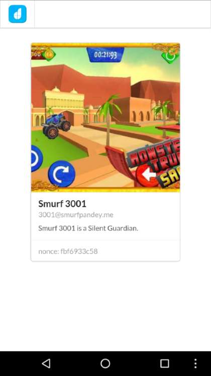

# SSO with DronaHQ User API

This sample app demonstrates how to use DronaHQ User method to get profile of currently logged-in user.
Check our [documentation](http://docs.dronahq.com) to know more about DronaHQ APIs.

## About the app

This app retrieves the profile of currently logged-in user using `DronaHQ.user.getProfile()` method. 
The profile object also contains a property `nonce` which can be used to securely generate a session token from
your backend APIs.

## Support

dev[at]dronahq[dot]com