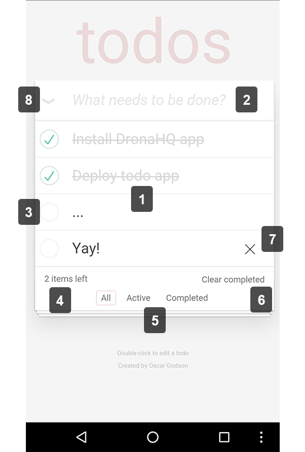

# Todo App with DronaHQ Key-Value storage

This sample app demonstrates how to use DronaHQ key-value storage to store, retrieve & delete data.
Check our [documentation](http://docs.dronahq.com) to know more about key-value storage.

## About the app

This sample app, despite its small size, contains most of the behaviors typical in modern mobile applications. 

<div style="text-align:center"></div>

1. It displays a list of todos for a user to see. This list will grow and shrink as the user adds and removes todos.

2. It accepts text in an `<input>` for entry of new todos. Hitting the `<enter>` key creates the new item and displays it in the list below.

3. It provides a checkbox to toggle between complete and incomplete states for each todo. New todos start as incomplete.

4. It displays the number of incomplete todos and keeps this count updated as new todos are added and existing todos are completed.

5. It provides links for the user to navigate between lists showing all, incomplete, and completed todos.

6. It provides a button to remove all completed todos and informs the user of the number of completed todos. This button will not be visible if there are no completed todos.

7. It provides a button to remove a single specific todo. This button displays as a user hovers over a todo and takes the form of a red X.

8. It provides a checkbox to toggle all existing todos between complete and incomplete states. Further, when all todos are completed this checkbox becomes checked without user interaction.

- It persists a user's todos by using the dronahq's key-value storage.

## About the code

This code is a adaption of TodoMVC project. We are using [vanillajs example](https://github.com/tastejs/todomvc/tree/master/examples/vanillajs), with 2 changes to make it run on DronaHQ.

1. Initialize the app after `deviceready` event.

    ```
    //From js\app.js

    //Wrap the app initialization method inside deviceready method
    document.addEventListener('deviceready', function(){
        var todo = new Todo('todos-vanillajs');

        function setView() {
            todo.controller.setView(document.location.hash);
        }
        $on(window, 'load', setView);
        $on(window, 'hashchange', setView);

        setView();
    });
    ```

2. Use dronahq's kv-store methods instead of browser's localstorage.
All the DronaHQ methods are asynchronous, so we have used callback functions 

    ```
    //From js\store.js

    //Common method to get & set values
    function _getItem(keyName, callback, error) {
        DronaHQ.KVStore.getItem(keyName, function(data){
            callback(data.value);
        }, function(e){
            if(typeof error === 'function'){
                error(e);
            }
        });
    };

    function _setItem(keyName, value, callback) {
        DronaHQ.KVStore.setItem(keyName, value, callback, function(e){console.error(e)});
    };
    ```

## Support

dev[at]dronahq[dot]com